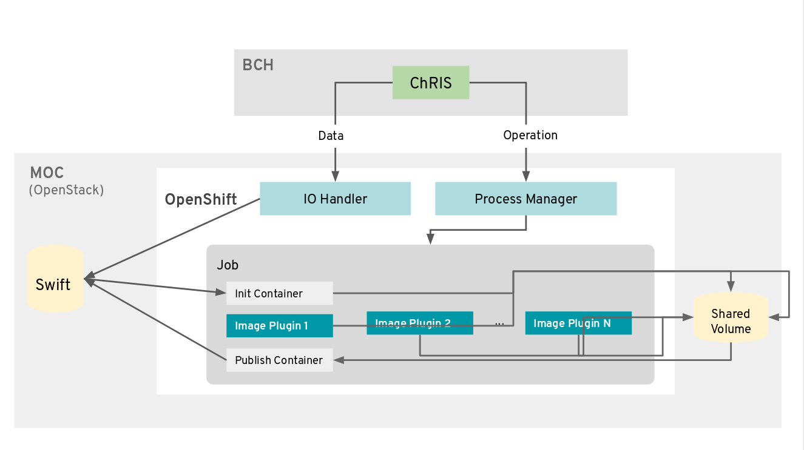

# Project Proposal: Integrating Medical AI Compute CPU/GPU worklows on the MOC -- PowerPC and x86-64 -- Using OpenShift

Project Members: Elaine Parr, Mohit Chandarana, Reed Hansen, Ziyu Liu

## 1. Vision and goals of the project

With the fast development of computing technologies in recent decades, there has been a huge amount of work in the medical image research area. However, these works are rarely used in practice at scale, due to the heterogeneity of deployment used by different researchers. ChRIS (ChRIS Research Integration Service) developed at Boston Children's Hospital is a general-purpose compute/data platform that simplifies deploying analysis on a heterogenous mix of computer environments (workstations, local networks, HPC clusters, public clouds). Our purpose is to enable ChRIS to utilize the rich computing resources of the Massachusetts Open Cloud (MOC).

The primary goal of this project is to enable the execution of existing ChRIS workflows on the MOC, specifically on the x86-64 cluster. The ChRIS Ultron Backend (CUBE) interacts with a compute service and manages compute tasks such as neuroimaging analysis, COVID detection from CT scans, etc. Our goal is to build production level utilities on the MOC that allow the CUBE to run compute tasks on MOC. The process and file utilities (pman and pfioh) run in a local docker-swarm environment and need to be properly configured and deployed to run in the MOC using OpenShift’s container orchestration.

Additional goals are included in the acceptance criteria section.

## 2. Users

The users of our project will be ChRIS developers and other power users.

* ChRIS Developers will use the results of our project to provide the option of executing tasks on the MOC for new workflows, as well as additional functions around using the MOC
* Power users like admins will use the results of our project to incorporate new algorithms (packed as plugins) that utilize the compute capacity of the MOC

## 3. Scope and features

The scope of this project is generally adapting existing features to function on the MOC. We hope to add a few novel features, such as allowing users to choose between computing in the x86-64 or PowerPC environments of the MOC. New workflows will not be created. Adapting the COVID-NET workflow to run on the MOC will be the primary goal.

Features to create:

* Adapt the existing input/output functionality of the pfioh module to OpenShift
* Adapt the existing workflow management functionally of the pman module to OpenShift
* Allow for each task in a workflow to be run by the MOC or in a local Docker swarm
  * Make the appropriate adjustments to the existing GUI to allow these options
* Allow for task execution in either the x86-64 or PowerPC environments of the MOC
* Change computation from the CPU to the GPU where appropriate

## 4. Solution concept

Below is a diagram of the system components with MOC incorporated.

The ChRIS frontend and backend are hosted within the institutional network. Two ChRIS components, pfman and pfioh, are hosted on MOC OpenShift. Compute tasks are actually executed in MOC OpenShift as well.

In production, an application like COVID-Net is packed as a “plugin”. When a plugin is run, the algorithms are sent from ChRIS to pfman which manages processes, and data is sent to pfioh which then keeps the data in OpenStack Swift object storage. pman then schedules (potentially parallel) Kubernetes job pods, executing the algorithm with data stored in Swift.

The focus of this project is on the deployment of the two components, pfman and pfioh. Detailed solution is a work in progress.

(source: https://github.com/FNNDSC/CHRIS_docs)

## 5. Acceptance criteria

The minimum acceptance criteria is to enable the execution of COVID-NET workflow on the MOC using OpenShift in x86-64.

Stretch goals include:

* Get all of the workflows to run on the MOC using OpenShift in x86-64
* Get any/all of the workflows to run on the MOC using OpenShift in PowerPC
* Enable crossover run: running any workflow node locally or on MOC (x86-64 or PowerPC), with data seamlessly transferred from one node to another
* Refactor compute nodes to use GPU where applicable

## 6. Release planning

* Sprint 1:
  * ChRIS backend local installation
  * Familiarizing ChRIS structure
  * Learning OpenShift
* Sprint 2:
  * Pack deployment-ready pman and pfioh images
  * Deploy these images on MOC OpenShift
* Sprint 3:
  * Run a COVID-NET workflow on MOC via pman/pfioh deployed
* Sprint 4 & 5:
  * Spillover tasks and stretch goals
